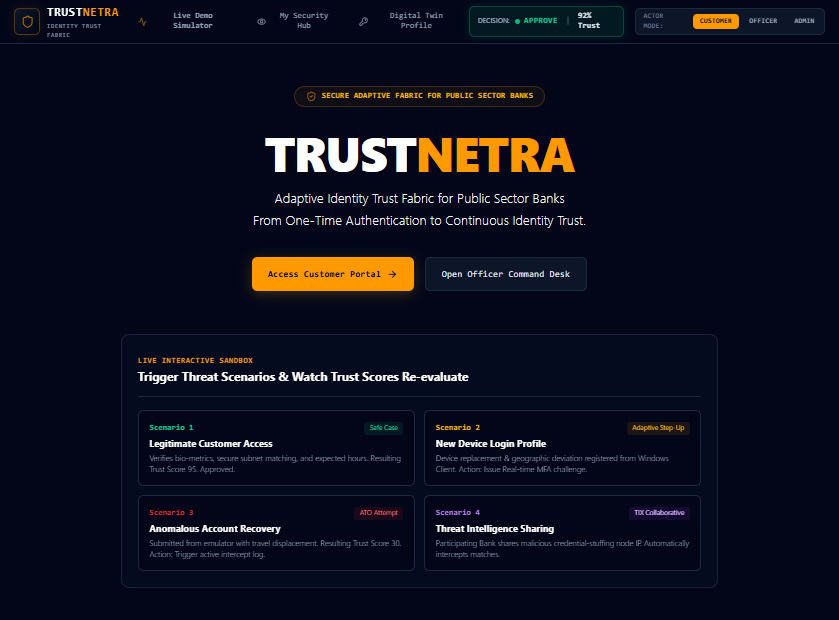

# 🛡️ TRUSTNETRA

### Adaptive Identity Trust Fabric for Public Sector Banks

> **Trust Every Identity. Verify Every Risk.**  
> From one-time authentication to continuous identity trust.



---

## 🌐 Live Demo

🚀 **Live Application:**  
https://banking-cybersecurity-platform-450369055017.asia-southeast1.run.app/

---

## 💡 Overview

**TRUSTNETRA** is an Adaptive Identity Trust Fabric designed for **Public Sector Banks (PSBs)** to move beyond one-time authentication toward **continuous identity trust**.

The platform continuously evaluates identity behavior, device signals, contextual risk, and transaction patterns to determine whether an authenticated identity should continue to be trusted.

Instead of treating authentication as the end of the security process, TRUSTNETRA treats it as the beginning of continuous risk evaluation.

### Core Idea

```text
One-Time Authentication
          ↓
Continuous Identity Trust
          ↓
Real-Time Risk Evaluation
          ↓
Adaptive Security Decisions
```

TRUSTNETRA combines three core pillars:

- 🪪 **Identity Digital Twin**
- 🔐 **Adaptive Trust Engine**
- 🧠 **Trust Intelligence Exchange (TIX) / PIIF**

Together, these layers enable a proactive approach to banking cybersecurity and fraud prevention.

---

# 🎯 The Problem

### Authentication ends at login. Fraud doesn't.

Modern banking threats increasingly exploit legitimate authenticated sessions rather than simply attempting to break through the initial login barrier.

TRUSTNETRA focuses on addressing threat vectors including:

- 🔴 Account Takeover
- 🔴 Post-login Session Exploitation
- 🔴 Synthetic Identity Fraud
- 🔴 Suspicious Account Recovery
- 🔴 New Device Risk
- 🔴 Insider Misuse
- 🔴 Behavioral Anomalies

Traditional authentication systems often follow:

```text
User Login
    ↓
Credentials Verified
    ↓
Access Granted
```

The challenge is that once access is granted, the identity may continue to be trusted even if its behavior changes significantly.

TRUSTNETRA shifts the security model from:

> **Trust as a Gate**

to:

> **Trust as a Continuous Fabric**

---

# 💡 Our Solution

TRUSTNETRA continuously evaluates the trustworthiness of an identity using behavioral, device, contextual, and transaction signals.

The platform follows a continuous trust evaluation pipeline:

```text
User Channels
Mobile · Web · ATM · Branch
        ↓
Signal Collection
Device · Behavior · Context
        ↓
Identity Digital Twin
Behavioral Baseline
        ↓
Adaptive Trust Engine
Real-Time Risk Scoring
        ↓
Decision Layer
Approve · Verify · Block
        ↓
Trust Intelligence Exchange
Cross-Bank Intelligence
```

The core question changes from:

> **"Is this user authenticated?"**

to:

> **"Should we continue trusting this identity based on its current behavior and risk?"**

---

# 🧩 Three Core Pillars

## 🪪 1. Identity Digital Twin

The **Identity Digital Twin** learns the normal behavioral patterns associated with an identity.

It builds a behavioral baseline using signals such as:

- Device behavior
- Access timing
- Geographic patterns
- Transaction posture
- Historical activity
- Behavioral patterns

The system then compares:

```text
Expected Behavior
        ↓
Current Behavior
        ↓
Deviation Detection
        ↓
Risk Evaluation
```

This enables TRUSTNETRA to detect deviations from normal behavior instead of relying only on incorrect passwords or failed authentication attempts.

---

## 🔐 2. Adaptive Trust Engine

The **Adaptive Trust Engine** evaluates identity risk in real time.

Rather than applying the same authentication requirements to every user and every session, the system adapts its response according to the current risk level.

```text
Normal Behavior
       ↓
Low Risk
       ↓
Continuous Monitoring
```

When risk increases:

```text
New Risk Signal
       ↓
Trust Score Re-Evaluation
       ↓
Risk-Based Decision
       ↓
Approve / Verify / Block
```

The objective is to **step up security only when risk actually rises**, enabling a more adaptive and context-aware security experience.

---

## 🧠 3. Trust Intelligence Exchange (TIX) / PIIF

The **Trust Intelligence Exchange (TIX)** is designed to enable cross-bank threat intelligence sharing without sharing raw customer personally identifiable information.

The **Privacy-Preserving Intelligence Framework (PIIF)** is built around:

- Federated Learning
- Secure Aggregation
- Differential Privacy

The intended model is:

```text
Bank A
   │
   ├── Local Data
   │
   ▼
Local Intelligence
   │
   └──────────┐
              │
Bank B        │
   │          │
   ├── Local Data
   │          │
   ▼          │
Local Intelligence
              │
              ▼
     Privacy-Preserving
     Intelligence Exchange
              │
              ▼
       Shared Threat Signals
```

The goal is to enable participating banks to benefit from cross-bank intelligence while keeping raw customer data within the originating institution.

---

# 🛡️ Key Features

### 🪪 Identity Digital Twin

Learns and maintains a behavioral baseline for identities and identifies deviations from expected behavior.

### 🔐 Adaptive Trust Scoring

Continuously evaluates identity risk and adjusts trust decisions as new signals emerge.

### 🧪 Interactive Scenario Simulator

Enables demonstration of different cybersecurity scenarios and observes how trust scores and security decisions change.

Supported scenarios include:

- Legitimate Login Access
- New Device Login Profile
- Suspicious Account Recovery
- Threat Intelligence Sharing

### 🚨 Fraud & Incident Monitoring

Provides centralized visibility into security alerts, threat activity, detection performance, and threat categories.

### 🧠 Threat Intelligence

Supports identification and categorization of threat signals and enables intelligence-driven security decisions.

### 🤖 AI & ML Security Models

Supports AI-assisted capabilities for:

- Anomaly Detection
- Fraud Detection
- Behavioral Analysis
- Risk Classification
- Security Intelligence

### 📊 Explainable Security Insights

Provides contextual information to help analysts understand why an identity or activity may have been flagged.

### 🔄 Continuous Risk Evaluation

Moves security beyond one-time authentication by continuously evaluating identity trust throughout the session lifecycle.

---

# 🖥️ Working Prototype

TRUSTNETRA is demonstrated through a deployed working prototype with multiple functional security interfaces.

The prototype includes:

- Identity Security Hub
- Interactive Scenario Simulator
- Identity Digital Twin Ledger
- Incident Response & Fraud Monitor
- Global Systems Configuration & AI Models

The deployed application demonstrates the concept of continuous identity trust through interactive security workflows and trust-score evaluation.

---

# 🏗️ Technology Architecture

```text
┌──────────────────────────────────────────────┐
│                 USER CHANNELS                │
│          Mobile · Web · ATM · Branch         │
└──────────────────────┬───────────────────────┘
                       │
                       ▼
┌──────────────────────────────────────────────┐
│              SIGNAL COLLECTION               │
│        Device · Behavior · Context           │
└──────────────────────┬───────────────────────┘
                       │
                       ▼
┌──────────────────────────────────────────────┐
│            IDENTITY DIGITAL TWIN             │
│             Behavioral Baseline              │
└──────────────────────┬───────────────────────┘
                       │
                       ▼
┌──────────────────────────────────────────────┐
│             ADAPTIVE TRUST ENGINE             │
│             Real-Time Risk Scoring            │
└──────────────────────┬───────────────────────┘
                       │
                       ▼
┌──────────────────────────────────────────────┐
│               DECISION LAYER                │
│             Approve · Verify · Block         │
└──────────────────────┬───────────────────────┘
                       │
                       ▼
┌──────────────────────────────────────────────┐
│          TRUST INTELLIGENCE EXCHANGE         │
│       Privacy-Preserving Intelligence        │
└──────────────────────────────────────────────┘
```

---

# 🧰 Technology Stack

| Layer | Technologies |
|---|---|
| Frontend | ReactJS, NextJS |
| Backend | Python, FastAPI |
| AI & ML | Scikit-Learn, XGBoost, TensorFlow, NLP |
| Data | PostgreSQL, Redis |
| DevOps | Docker, Kubernetes |
| Deployment | Cloud Run |
| Security | Behavioral Analytics, Device Fingerprinting, Risk Scoring, Explainable AI |
| Privacy | Federated Learning, Secure Aggregation, Differential Privacy |

---

# 🔐 Privacy-Preserving Intelligence Framework

The PIIF layer is designed to support cross-bank intelligence while preserving data privacy.

### Federated Learning

Models can be trained using distributed data without requiring raw customer datasets to be centralized.

### Secure Aggregation

Shared intelligence can be aggregated without exposing individual participating institutions' raw signals.

### Differential Privacy

Privacy-preserving techniques can be used to reduce the risk of identifying individuals from shared intelligence.

### Result

```text
Cross-Bank Intelligence
        +
Privacy Preservation
        ↓
Shared Threat Awareness
        ↓
No Raw Customer PII Exchange
```

---

# 🚨 Banking Security Use Cases

| Threat | TRUSTNETRA Response |
|---|---|
| Account Takeover | Continuous identity and behavioral evaluation |
| Post-Login Session Exploitation | Continuous trust monitoring |
| Synthetic Identity Fraud | Behavioral deviation analysis |
| Suspicious Recovery | Risk-based trust re-evaluation |
| New Device Risk | Device and contextual risk signals |
| Insider Misuse | Behavioral anomaly detection |
| Behavioral Anomalies | Identity baseline comparison |
| Cross-Bank Threats | Privacy-preserving intelligence exchange |

---

# 📈 Scalability & Deployment

TRUSTNETRA is designed with an incremental deployment approach.

## Phase 1 — Single-Bank Pilot

Deploy the:

- Identity Digital Twin
- Adaptive Trust Engine

within a single PSB and limited channels.

↓

## Phase 2 — Trust Intelligence Exchange

Connect participating banks to the TIX network using privacy-preserving intelligence sharing.

↓

## Phase 3 — Multi-PSB Scale

Expand across channels and multiple banks with a potential shared infrastructure path.

### Deployment Model

```text
Single Bank Pilot
       ↓
Trust Intelligence Exchange
       ↓
Multi-PSB Network
       ↓
Shared Banking Security Intelligence
```

---

# 📊 Design Targets

The following are **design targets intended to be validated during pilot deployment**, not production-validated performance results:

| Metric | Target |
|---|---|
| Potential Account Takeover Reduction | 30–50% |
| Trust Score Response Time | < 200ms |
| Risk Event Throughput | 1,000+ events/sec |

These targets are intended to guide future pilot validation and production-scale testing.

---

# 🏦 Regulatory Alignment

The TRUSTNETRA concept has been mapped against relevant Indian banking, privacy, and cybersecurity frameworks, including:

- DPDP Act 2023
- RBI Cyber Security Framework
- RBI Master Direction – KYC
- RBI Digital Banking Security Guidelines
- CERT-In Incident Reporting
- UIDAI Aadhaar / eKYC Ecosystem
- IT Act 2000

The PIIF architecture is designed around the principle that sensitive customer data should remain within the originating institution while enabling privacy-preserving intelligence sharing.

---

# 🔄 Development Roadmap

```text
                    NOW
                 Prototype
                     │
                     ▼
        ┌─────────────────────────┐
        │ 8 Working Screens       │
        │ Trust Score Engine      │
        │ Fraud Monitor           │
        │ Scenario Simulator      │
        └────────────┬────────────┘
                     │
                     ▼
                   AUG
             Post-Hackathon
                     │
                     ▼
        ┌─────────────────────────┐
        │ IP Filing & Incubation  │
        │ RBI Sandbox Application │
        │ BOB Pilot MoU           │
        │ CERT-In Integration     │
        └────────────┬────────────┘
                     │
                     ▼
                   OCT
                  Pilot
                     │
                     ▼
        ┌─────────────────────────┐
        │ Single-Bank Deployment  │
        │ Digital Twin + Engine   │
        │ Real Transaction Data   │
        │ Performance Baseline    │
        └────────────┬────────────┘
                     │
                     ▼
                 Q1 2027
              TIX Network
                     │
                     ▼
        ┌─────────────────────────┐
        │ Multi-Bank Onboarding   │
        │ PIIF Federated Layer    │
        │ DFS Shared Infrastructure│
        └─────────────────────────┘
```

---

# 🚀 Future Scope

The next stages of TRUSTNETRA can focus on:

- Single-bank pilot deployment
- Real transaction data integration
- Performance baseline validation
- Privacy-preserving multi-bank intelligence
- Federated learning implementation
- Integration with banking security infrastructure
- RBI regulatory sandbox exploration
- CERT-In integration
- Multi-PSB onboarding
- Shared PSB security infrastructure

---

# 🏆 Why TRUSTNETRA?

Traditional banking security often treats authentication as the point where trust begins and ends.

TRUSTNETRA proposes a different approach:

```text
Traditional Model

Authenticate
     ↓
Trust
     ↓
Access
```

### TRUSTNETRA Model

```text
Authenticate
     ↓
Establish Identity Baseline
     ↓
Continuously Monitor
     ↓
Evaluate Risk
     ↓
Recalculate Trust
     ↓
Adapt Security Decision
```

Our core innovation combines:

> **Identity Digital Twin**

+

> **Adaptive Trust Engine**

+

> **Privacy-Preserving Cross-Bank Intelligence**

to create an adaptive security fabric for public-sector banking.

---

# 👥 Team TRUSTNETRA

### Parul University

Our team brings together capabilities across solution architecture, backend engineering, frontend development, AI/ML, security, and product execution.

### Team Members

**Soumya Pandey**  
Team Lead & Solution Architect

Focus:
- System Architecture & Design
- Product Strategy
- Solution Design
- Prototype Integration & Coordination

**Sonam Giri**  
Backend · APIs · Database

Focus:
- Python & FastAPI
- PostgreSQL & Redis
- REST API Design
- Backend Architecture
- Trust Scoring Backend Logic

**Lakshay Patidar**  
Frontend · React/Next.js · UI/UX

Focus:
- React.js & Next.js
- Component Architecture
- UI/UX Design
- Frontend Performance
- Prototype Screens & Dashboard Experience

---

# 🎯 Project Vision

TRUSTNETRA aims to help public-sector banks transition from:

> **One-Time Authentication → Continuous Identity Trust**

and from:

> **Reactive Fraud Detection → Proactive, Continuous Identity Trust Assurance**

---

**Thank You !**

---
